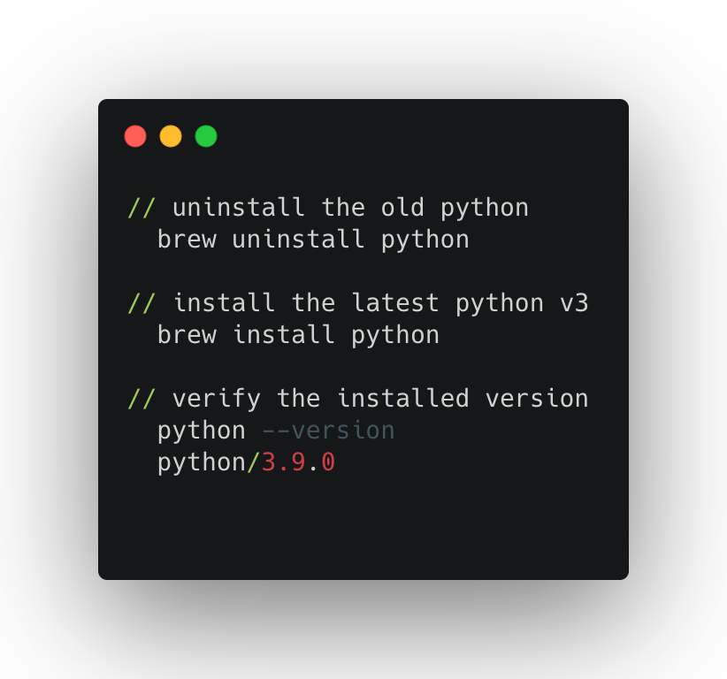
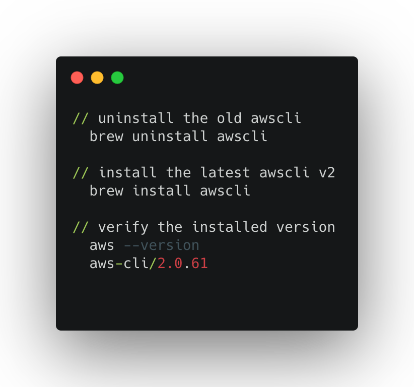
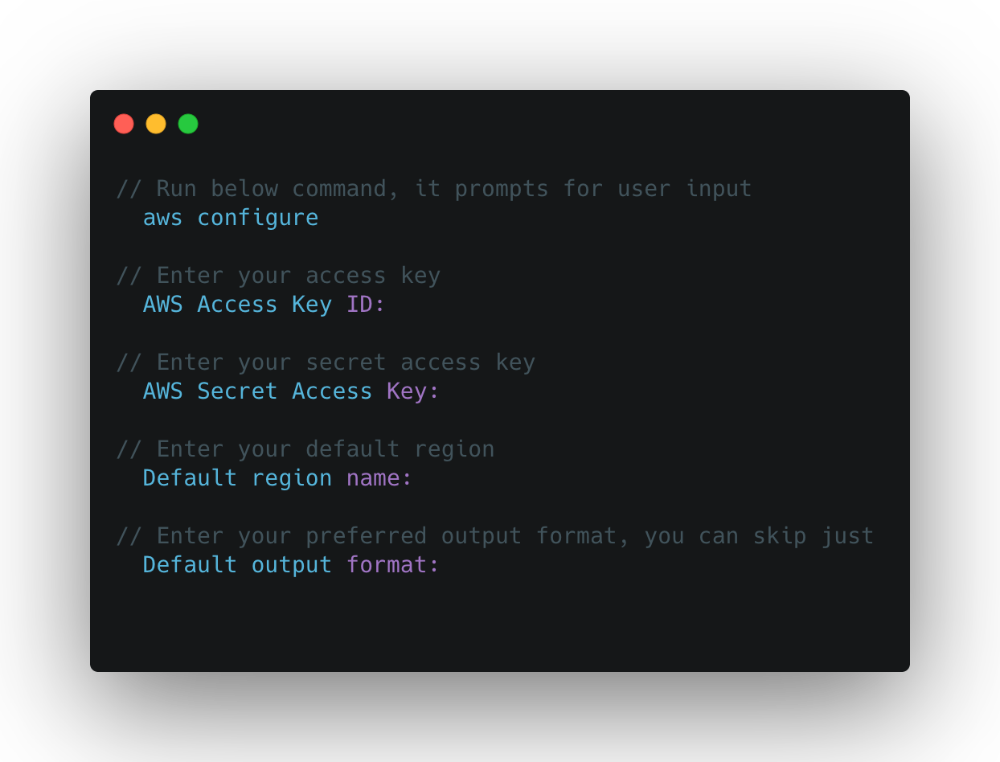
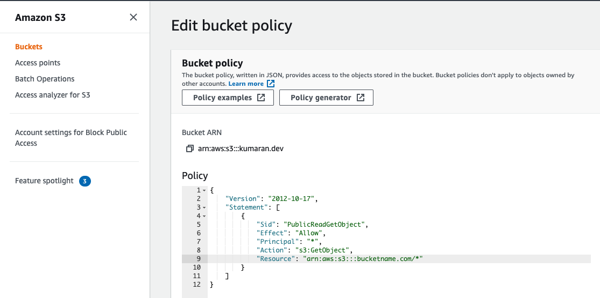

# Covid Tracker

Covid Tracker is a web application built using [Angular v10.2.0](https://github.com/angular) to track `COVID-19` cases around the world.

This application consumes API <https://corona.lmao.ninja/v2/countries> from [covid-19 global stats](https://corona.lmao.ninja/) and hosted on AWS S3 uses CloudFront, Certificate Manager and Route 53.

There are 2 ways you can launch the application :

1. Application is hosted on `Github Pages`, you can launch the application on your browser directly, by [clicking here](https://kumaran-is.github.io/covid-tracker).

2. Launch the application on [StackBlitz](https://stackblitz.com/), by [clicking here](https://stackblitz.com/github/kumaran-is/covid-tracker). [StackBlitz](https://stackblitz.com/) is a online code editor built on top of vscode editor, where you can edit and see your changes on the fly.

**Table of contents:**

1. [Prerequisites and Installation](#prerequisites-and-installation)
2. [Dependencies and Libraries](#dependencies-and-libraries)
3. [Quick Start](#quick-start)
4. [Host the Application on AWS S3 using AWS CLI](#host-the-application-on-aws-s3-using-aws-cli)
5. [Register and Configure domain](#register-and-configure-domain)
6. [Create SSL certificate using AWS Certificate Manager](#create-ssl-certificate-using-aws-certificate-manager)
7. [Configuring CloudFront](#configuring-cloudfront)
8. [Adding A Record to Route 53 Hosted Zone](#adding-a-record-to-route-53-hosted-zone)
9. [Terraform to Setup Infrastructure](#terraform-to-setup-infrastructure)
10. [Publish Angular Application to Github Pages](#publish-angular-application-to-github-pages)
11. [Status and Issues](#status-and-issues)

## Prerequisites and Installation

1. Create a free-tier account in [AWS](www.aws.amazon.com).

2. Create an `IAM` user  with [AdministratorAccess](https://console.aws.amazon.com/iam/home?region=us-east-1#/policies/arn:aws:iam::aws:policy/AdministratorAccess$jsonEditor) policy and [AmazonS3FullAccess](https://console.aws.amazon.com/iam/home?region=us-east-1#/policies/arn:aws:iam::aws:policy/AmazonS3FullAccess$jsonEditor) policy. It is highly recommended not to use `Root` account.

3. Install Python v3.9.x

   

4. Install AWS CLI v2
   

5. Configure AWS CLI. To configure the AWS CLI you’ll need the following from your AWS account :

   1. Access Key Id

   2. Secret Key
   3. Default AWS region
   



## Dependencies and Libraries

Library | Version | Notes
:-------|:--------:|-------
[Node](https://nodejs.org/) | 12.13.x | Recommended NodeJS version
[NPM](https://nodejs.org/) | 6.12.x | Recommended NPM version
[Angular](https://angularjs.org/) | 10.x.x. | JavaScript-based open-source front-end SPA framework
[Python](https://www.python.org/)| ~3.9.x | programming language
[awscli](https://aws.amazon.com/cli/)| ~2.x.x | AWS Command Line Interface


## Quick Start

1. Clone repository and enter it

  ```bash
  git clone https://github.com/kumaran-is/covid-tracker.git
  cd covid-tracker
  ```

2. Install NPM and Bower dependencies

  ```bash
  npm install
  ```

3. Run the application locally. Navigate to <http://localhost:4200/>. The app will automatically reload if you change any of the source files.

  ```bash
 ng serve --o
  ```

## Host the Application on AWS S3 using AWS CLI

1. Run below command to create a bucket in S3. This command creates a bucket in  `us-east-1` AWS region. 👉 Make sure to replace `bucket_name` with your own `yourdomainname` and `region` with the region that you want to create the bucket in the package.json scripts `aws-cb`.
👉 Note: Bucket name must be unique across all existing bucket names in Amazon S3. The bucket name should be same as domain or subdomain. Example something like `yourdomainname.com` or `dev.yourdomainname.com`.

  ```bash
  npm run aws-cb
  ```

2. Run below command to enable S3 for static web hosting. 👉 Make sure to replace `bucket_name` with your own `yourdomainname` in package.json script `aws-website`

  ```bash
  npm run aws-website
  ```

3. To make your hosted Angular app available to the public, all objects in the S3 bucket need to be publicly accessible. Go to your bucket in AWS console and create a bucket policy for you S3 bucket as mentioned below. 👉 Make sure to replace `bucket_name` with your own `yourdomainname`

  ```JSON
 {
    "Version": "2012-10-17",
    "Statement": [
        {
            "Sid": "PublicReadGetObject",
            "Effect": "Allow",
            "Principal": "*",
            "Action": "s3:GetObject",
            "Resource": "arn:aws:s3:::bucketname.com/*"
        }
    ]
}
  ```



or To avoid going to AWS console and creating the bucket policy manually, run the below command. 👉 Make sure to replace `bucket_name` with your own `yourdomainname` in the [Policy file](./docs/bucketpolicy.json) and in package.json script `aws-b-policy`.

  ```bash
  npm run aws-b-policy
  ```

4. Run below command to build and upload the angular application to S3 bucket that you just created. 👉 Note: Make sure to replace `bucket_name` with your own `yourdomain.com` in package.json script `aws-deploy`

  ```bash
  npm run aws-deploy
  ```

5. Verify the setup, by launching the application using Amazon S3 website endpoints <http://yourdomain.com.s3-website-<REGION NAME>.amazonaws.com>

## Register and Configure Domain

1. You can register a domain using  [Route53](https://console.aws.amazon.com/route53/home#DomainListing). Once Domain is registered, it will automatically  creates a `Hosted Zones` with `NS` Type and `SOA` record.

1. To host your website on `www`, create a another bucket `www.yourdomain.com`. This can be done by running below command. 👉 Note: Make sure to replace `bucket_name` with your own `www.yourdomain.com` in package.json script `aws-cb-www`

  ```bash
  npm run aws-cb-www
  ```

1. Go to your AWS S3 console, select the bucket `www.yourdomain.com`, click on properties, and enable “Static website hosting”. Select “Redirect requests”, enter `yourdomain.com` as the Host Name and set “Protocol” to https and  click Save. 👉 Note: No need to upload Angular application files to this bucket `www.yourdomain.com`, S3 “Redirect requests” will redirect all request internally to `yourdomain.com` bucket.

1. To make your hosted Angular app (www.yourdomain.com) available to the public, all objects in the S3 bucket need to be publicly accessible. Go to your bucket in AWS console and create a bucket policy for you S3 bucket as mentioned below. 👉 Make sure to replace `bucket_name` with your own `yourdomainname`

  ```JSON
 {
    "Version": "2012-10-17",
    "Statement": [
        {
            "Sid": "PublicReadGetObject",
            "Effect": "Allow",
            "Principal": "*",
            "Action": "s3:GetObject",
            "Resource": "arn:aws:s3:::www.bucketname.com/*"
        }
    ]
}
  ```

  or To avoid going to AWS console and creating the bucket policy manually, run the below command. 👉 Make sure to replace `bucket_name` with your own `www.yourdomainname` in the [Policy file](./docs/bucketpolicy-wwww.json) and in package.json script `aws-b-policy-www`.

  ```bash
  npm run aws-b-policy-www
  ```

1.  Verify the setup, by launching the application using `www` version of Amazon S3 website endpoints <http://www.yourdomainname.s3-website-<REGION NAME>.amazonaws.com>

## Create SSL certificate using AWS Certificate Manager

1. Go to AWS console and navigate to `AWS Certificate Manager` .

1. Click `Request a certificate` button and add two entries under “Add domain names”, one for `www.yourdomain.com` and another one for `yourdomain.com`

1. Choose the validation method as `DNS validation`. During the `DNS Validation`,  click add to `CNAME`, it will create 2 `CNAME` records ( one for `www.yourdomain.com` and another one for `yourdomain.com`) for certificate in the `Route53 Hosted Zone`. It will take few minutes to issue certificate

## Configuring CloudFront

1. 👉 Amazon S3 website endpoints do not support HTTPS. We need to setup either `CloudFront` or `ELB` for website to support HTTPS. `CloudFront` is an AWS content delivery network (CDN)

1. Go to AWS console and navigate to `CloudFront`, click `Create Distribution` and choose `Web` distribution and select “Get Started.”

1. In the input form field for “Origin Domain Name” some auto-complete options will appear and you will see your bucket listed 👉 but do not select your bucket REST end point <yourdomain.com.s3.amazonaws.com>. Instead enter your Amazon S3 website endpoint <http://yourdomainname.s3-website-<REGION NAME>.amazonaws.com> as the Origin Domain Name. This is very important because selecting bucket REST end point <yourdomain.com.s3.amazonaws.com> from the drop-down list can lead to issues with CloudFront redirecting to your bucket’s endpoint URL instead of forwarding.

1. Under `Default Cache Behavior Settings`, radio button field `Viewer Protocol Policy` select `Redirect HTTP to HTTPS` to ensure all users utilize secure connections.

1. Under `Distribution Settings`, from `Price Class` dropdown choose the regions you want your CDN to support serving website from edge locations.

1. Under `Distribution Settings`, in the textarea field `Alternate Domain Names
(CNAMEs)` enter your domains(www.yourdomain.com and yourdomain.com), one after another (one in each row).

1. You can leave the rest of the fields and click `Create Distribution` button. AWS may take few minutes to create your new distribution.

## Adding A Record to Route 53 Hosted Zone

1. We have `CloudFront` configured for static website hosting on S3 bucket. Now we need to map the `yourdomain.com` and `www.yourdomain.com` to `CloudFront` by creating two `A` alias records in the Route 53 hosted zone.

1. Create a record,  with record type `A` for host `www.yourdomain.com` using `simple routing` policy with `value/Route traffic` to  `Alias to CloudFront distribution` and choose corrsponding CloudFront distribution name.

1. Similarly create a record,  with record type `A` for host `yourdomain.com` using `simple routing` policy with `value/Route traffic` to  `Alias to CloudFront distribution` and choose corresponding CloudFront distribution name. It will take few minutes to issue certificate

1. It will take few minutes for Route 53 to complete the process. Now launch the application by navigating to www.yourdomain.com or <https://www.yourdomain.com>

## Terraform to Setup Infrastructure

1. Instead of using `AWS CLI` and `AWS console` to setup and configure `S3 bucket`, `CloudFront`, `Route 53` and `SSL certificate via AWS Certificate Manager`, we can replicate same infrastructure again and again using [Terraform](https://www.terraform.io/)

1. Coming soon.

## Publish Angular Application to Github Pages

`Github Pages` is a Github feature that allows you to deploy any static website or web application or Angular application from your `gh-pages` branch to `Github Pages` for free

Using [angular-cli-ghpages](https://www.npmjs.com/package/angular-cli-ghpages) library, you can easily publish your angular application to `Github Pages`.

1. Install [angular-cli-ghpages](https://www.npmjs.com/package/angular-cli-ghpages) as a devDependency to your project

    ```bash
    npm install angular-cli-ghpages --save-dev
    ```

1. Add below npm script to your `package.json`

    ```bash
    "scripts": {
      ....
      .....
      "prod-build": "ng build --prod --base-href=./",
      "git-publish": "npm run prod-build && npx angular-cli-ghpages --dir=dist/covid-tracker --branch=gh-pages"
    }
    ```

1. Publish your application from `gh-pages` branch to `Github Pages`. Branch `gh-pages` is automatically created for you. Command below,
first runs production build, automatically commits and pushes the changes from 'dist' folder to `gh-pages` branch and deploys it to `Github Pages`.
Branch `gh-pages` act as a staging folder for deployment.

    ```bash
    npm run git-publish
    ```

1. Launch your application on browser by navigating to `https://username.github.io/repo-name/`. Example to launch this application click this link <https://kumaran-is.github.io/covid-tracker>

1. For more detail and options, refer the official [angular-cli-ghpages](https://www.npmjs.com/package/angular-cli-ghpages) github.

## Status and Issues

* [Change History](./CHANGELOG.md).
* [Issue tracker](https://github.com/kumaran-is/covid-tracker/issues?state=open)
